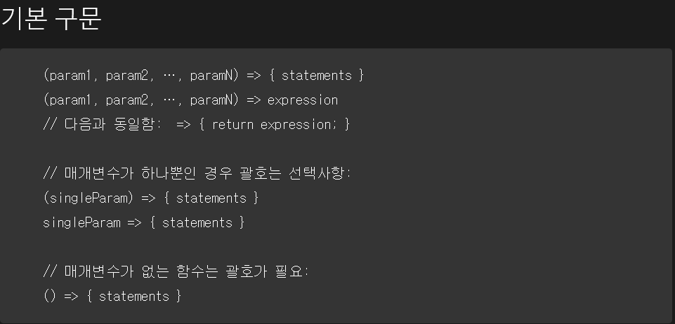

# 변수 선언
기존의 js의 변수 선언은 var로만 가능했으나
es6부터 let, const가 추가 되었다.

세가지의 선언의 차이점:
1. 중복선언 가능 여부
2. 재할당 가능 여부
3. 변수 스코프 유효범위
4. 변수 호이스팅 방식

## 중복선언 가능 여부

* var은 중복 선언이 가능
var로 선언한 변수는 중복해서 선언, 또는 초기화가 가능하다.
중복해서 선언한 경우엔 마지막에 할당된 값이 변수에 적용된다.
예를 들어
```Javascript
var a = 10;
console. log(a); //10
var a = 20;
console. log(a); //20
var a = 30;
console. log(a); //30
```
첫번째와 두번째 값은 초기화 되고 세번째 값으로 저장된다.
let, const와 다르게 유연하게 변수 선언이 가능하지만 중복 선언으로 인한 위험성이 있다.

* let, const는 중복 선언이 불가능
var와는 다르게 중복 선언이 불가능하여 이미 선언한 변수를 다시 선언할 경우에 에러가 난다.
var에 비해 코드의 안정성을 높여준다.

## 재할당

* var, let은 재할당이 가능하지만 const는 재할당이 불가능하다.
var, let은 변수를 선언하는 키워드이기 때문에 재할당이 가능하지만,
const는 상수를 선언하기 때문에 재할당이 불가능하다.

## 스코프(Scope)

스코프는 변수에 접근할 수 있는 범위를 말한디.
스코프는 전역(global)과 지역(local)로 나뉘며
전역 스코프는 전역에 선언되어 어느 곳에든지 해당 변수에 접근할 수 있고
지역 스코프는 해당 지역에서만 접근할 수 있어서 벗어난 곳에선 접근 할 수 없다.

자바스크립트에는 var과 let, const의 스코프가 다르다.

### var:함수 스코프(function scope)
var은 함수 내부에 선언된 변수만 지역변수로 한정하고, 나머지는 모두 전역으로 간주한다.
따라서 함수 내부에 선언된 변수는 함수 내부에서만 참조가 가능하고 외부에서 참조하면 에러가 발생한다.

### let, const:블록 스코프(block scope)
블록 스코프는 블록 내부({})에서 선언된 변수까지 지역 변수로 인정한다.
그래서 함수 뿐만 아니라 if, for문 같은 반복문의 코드 블록에서 선언된 변수도 지역 변수로 취급된다.
var과의 차이점은 var은 반복문의 코드블록에서 선언되어도 전역으로 취급하기 때문에 외부에서 참조가 가능하나
let, const는 지역변수로 취급되기 때문에 외부에서 참조가 불가능하다.

## 호이스팅(Hoisting)
호이스팅(hoisting)이란, 인터프리터가 변수와 함수의 메모리 공간을 선언 전에 미리 할당하는 것을 의미한다.
var로 선언한 변수의 경우 호이스팅 시 undefined로 변수를 초기화하지만 let과 const로 선언한 변수의 경우 호이스팅 시 변수를 초기화하지 않습니다.

### 호이스팅은 선언만

JavaScript는 초기화를 제외한 선언만 호이스팅한다. 변수를 먼저 사용하고 그 후에 선언 및 초기화가 나타나면, 사용하는 시점의 변수는 기본 초기화 상태(var 선언 시 undefined, 그 외에는 초기화하지 않음).

```Javascript
// 예제 1
// y만 호이스팅 대상

x = 1; // x 초기화. x를 선언하지 않은 경우 선언. 그러나 명령문에 var가 없으므로 호이스팅이 발생하지 않음
console.log(x + " " + y); // '1 undefined'
// JavaScript는 선언만 호이스팅하므로, 윗줄의 y는 undefined
var y = 2; // y를 선언하고 초기화

// 예제 2
// 호이스팅은 없지만, 변수 초기화는 (아직 하지 않은 경우) 변수 선언까지 병행하므로 변수를 사용할 수 있음

a = '크랜'; // a 초기화
b = '베리'; // b 초기화

console.log(a + "" + b); // '크랜베리'
```

### let, const의 호이스팅
`let`과 `const`로 선언한 변수도 호이스팅 대상이지만, `var`와 달리 호이스팅 시 `undefined`로 변수를 초기화하지는 않는다. 따라서 변수의 초기화를 수행하기 전에 읽는 코드가 먼저 나타나면 예외가 발생한다.

## 배열(Array)
자바스크립트에서 배열(array)은 이름과 인덱스로 참조되는 정렬된 값의 집합으로 정의된다.
배열을 구성하는 각각의 값을 배열 요소(element)라고 하며, 배열에서의 위치를 가리키는 숫자를 인덱스(index)라고 부른다.

자바스크립트에서 배열의 특징으로는
1. 배열 요소의 타입이 고정되어 있지 않으므로, 같은 배열에 있는 배열 요소끼리의 타입이 서로 다를 수도 있다.

2. 배열 요소의 인덱스가 연속적이지 않아도 되며, 따라서 특정 배열 요소가 비어 있을 수도 있다.

3. 자바스크립트에서 배열은 Array 객체로 다뤄진다.

### 배열의 생성
배열의 생성 방법:
```JavaScript
var arr = [배열1, 배열2] //배열 리터럴(대괄호[])을 이용하는 방법
var arr = Array(배열1, 배열2) //Array 객체의 생성자를 이용하는 방법
var arr = new Array(배열1, 배열2) // new 연산자를 이용한 Array객체 생성 방법
```

#### 배열 요소에 접근
배열의 인덱스는 0부터 시작한다. 즉, 배열 첫 번째 요소의 인덱스는 0이고, 마지막 요소의 인덱스는 배열의 length 속성에서 1을 뺀 것과 같다.
잘못된 인덱스를 사용하면 'undefined'를 반환한다.

#### 배열 길이와 숫자형 속성의 관계
JavaScript 배열의 length 속성과 숫자형 속성은 연결되어 있다.

몇몇 배열 내장 메서드(join, slice, indexOf 등)은 호출했을 때 배열의 length 속성의 값을 참고한다.

다른 메서드(push, splice 등) 또한 배열의 length 속성을 바꾸는 결과를 낳는다.

#### 메서드
[`Array.prototype.at()`](https://developer.mozilla.org/ko/docs/Web/JavaScript/Reference/Global_Objects/Array/at) 
주어진 인덱스의 요소를 반환합니다. 음수 값을 지정할 경우 인덱스를 배열의 끝부터 센다.

[`Array.prototype.concat()`](https://developer.mozilla.org/ko/docs/Web/JavaScript/Reference/Global_Objects/Array/concat)
배열과 배열/값 매개변수를 이어붙인 새로운 배열을 반환한다.

[`Array.prototype.copyWithin()`](https://developer.mozilla.org/ko/docs/Web/JavaScript/Reference/Global_Objects/Array/copyWithin)
배열 내의 지정된 요소들을 동일한 배열 내에서 복사한다.

[`Array.prototype.entries()`](https://developer.mozilla.org/ko/docs/Web/JavaScript/Reference/Global_Objects/Array/entries)
배열의 각 인덱스에 대한 키/값 쌍을 가지는 새로운 배열 반복자 객체를 반환한다.

[`Array.prototype.every()`](https://developer.mozilla.org/ko/docs/Web/JavaScript/Reference/Global_Objects/Array/every)
배열의 모든 요소가 주어진 판별 함수를 만족할 경우 `true`를 반환한다.

[`Array.prototype.fill()`](https://developer.mozilla.org/ko/docs/Web/JavaScript/Reference/Global_Objects/Array/fill)
배열을 시작 인덱스부터 끝 인덱스까지의 지정한 값으로 채운다.

[`Array.prototype.filter()`](https://developer.mozilla.org/ko/docs/Web/JavaScript/Reference/Global_Objects/Array/filter)
지정한 필터 함수의 반환 결과가 `true`인 요소만 모아서 새로운 배열을 반환한다.

[`Array.prototype.find()`](https://developer.mozilla.org/ko/docs/Web/JavaScript/Reference/Global_Objects/Array/find)
주어진 판별 함수를 만족하는 첫 번째 요소를 반환합니다. 만족하는 요소가 없으면 `undefined`를 반환한다.

[`Array.prototype.findIndex()`](https://developer.mozilla.org/ko/docs/Web/JavaScript/Reference/Global_Objects/Array/findIndex)
주어진 판별 함수를 만족하는 첫 번째 요소의 인덱스를 반환합니다. 만족하는 요소가 없으면 `-1`를 반환한다.

[`Array.prototype.flat()`](https://developer.mozilla.org/ko/docs/Web/JavaScript/Reference/Global_Objects/Array/flat)
배열 내의 모든 중첩 배열을 지정한 깊이까지 재귀적으로 이어붙인 새로운 배열을 반환한다.

[`Array.prototype.flatMap()`](https://developer.mozilla.org/ko/docs/Web/JavaScript/Reference/Global_Objects/Array/flatMap)
배열의 모든 요소 각각에 대해 주어진 콜백 함수를 호출하고, 그 반환 값을 모아 새로운 배열을 생성한 후, 모든 중첩 배열을 이어붙여 평탄화해 반환한다.

[`Array.prototype.forEach()`](https://developer.mozilla.org/ko/docs/Web/JavaScript/Reference/Global_Objects/Array/forEach)
배열의 각각의 요소에 대해 함수를 호출한다.

[`Array.prototype.includes()`](https://developer.mozilla.org/ko/docs/Web/JavaScript/Reference/Global_Objects/Array/includes)
배열이 주어진 값을 포함하는지 판별해 `true` 또는 `false`를 반환한다.

[`Array.prototype.indexOf()`](https://developer.mozilla.org/ko/docs/Web/JavaScript/Reference/Global_Objects/Array/indexOf)
배열에서 주어진 값과 일치하는 제일 앞의 인덱스를 반환합니다. 없으면 `-1`을 반환한다.

[`Array.prototype.join()`](https://developer.mozilla.org/ko/docs/Web/JavaScript/Reference/Global_Objects/Array/join)
배열의 모든 요소를 문자열로 합친다.

[`Array.prototype.keys()`](https://developer.mozilla.org/ko/docs/Web/JavaScript/Reference/Global_Objects/Array/keys)
배열의 각 인덱스에 대한 키를 가지는 새로운 배열 반복자 객체를 반환한다.

[`Array.prototype.lastIndexOf()`](https://developer.mozilla.org/ko/docs/Web/JavaScript/Reference/Global_Objects/Array/lastIndexOf)
배열에서 주어진 값과 일치하는 제일 뒤의 인덱스를 반환합니다. 없으면 `-1`을 반환한다.

[`Array.prototype.map()`](https://developer.mozilla.org/ko/docs/Web/JavaScript/Reference/Global_Objects/Array/map)
배열의 모든 요소 각각에 대하여 주어진 콜백 함수를 호출하고, 그 반환 값을 모은 새로운 배열을 반환한다.

[`Array.prototype.pop()`](https://developer.mozilla.org/ko/docs/Web/JavaScript/Reference/Global_Objects/Array/pop)
배열에서 마지막 요소를 뽑아내고, 그 요소를 반환한다.

[`Array.prototype.push()`](https://developer.mozilla.org/ko/docs/Web/JavaScript/Reference/Global_Objects/Array/push)
배열의 끝에 하나 이상의 요소를 추가하고, 배열의 변경된 `length`를 반환한다.

[`Array.prototype.reduce()`](https://developer.mozilla.org/ko/docs/Web/JavaScript/Reference/Global_Objects/Array/Reduce)
주어진 콜백 함수를 가산기와 요소 각각에 대해 (왼쪽에서 오른쪽으로) 호출하여 하나의 값으로 줄인 결과를 반환한다.

[`Array.prototype.reduceRight()`](https://developer.mozilla.org/ko/docs/Web/JavaScript/Reference/Global_Objects/Array/ReduceRight)
주어진 콜백 함수를 가산기와 요소 각각에 대해 (오른쪽에서 왼쪽으로) 호출하여 하나의 값으로 줄인 결과를 반환한다.

[`Array.prototype.reverse()`](https://developer.mozilla.org/ko/docs/Web/JavaScript/Reference/Global_Objects/Array/reverse)
배열의 요소 순서를 뒤집습니다. 즉 첫 번째 요소가 마지막이 되고 마지막이 첫 번째가 된다.

[`Array.prototype.shift()`](https://developer.mozilla.org/ko/docs/Web/JavaScript/Reference/Global_Objects/Array/shift)
배열에서 첫 번째 요소를 삭제하고, 그 요소를 반환한다.

[`Array.prototype.slice()`](https://developer.mozilla.org/ko/docs/Web/JavaScript/Reference/Global_Objects/Array/slice)
배열의 일부를 추출한 새 배열을 반환한다.

[`Array.prototype.some()`](https://developer.mozilla.org/ko/docs/Web/JavaScript/Reference/Global_Objects/Array/some)
배열의 어떤 요소가 주어진 판별 함수를 만족할 경우 `true`를 반환한다.

[`Array.prototype.sort()`](https://developer.mozilla.org/ko/docs/Web/JavaScript/Reference/Global_Objects/Array/sort)
배열의 요소를 정렬하고 그 배열을 반환한다.

[`Array.prototype.splice()`](https://developer.mozilla.org/ko/docs/Web/JavaScript/Reference/Global_Objects/Array/splice)
배열에서 요소를 추가하거나 삭제한다.

[`Array.prototype.toLocaleString()`](https://developer.mozilla.org/ko/docs/Web/JavaScript/Reference/Global_Objects/Array/toLocaleString)
배열과 그 요소를 나타내는 지역화된 문자열을 반환한다.  [`Object.prototype.toLocaleString()`](https://developer.mozilla.org/ko/docs/Web/JavaScript/Reference/Global_Objects/Object/toLocaleString) 메서드를 재정의합니다.

[`Array.prototype.toString()`](https://developer.mozilla.org/ko/docs/Web/JavaScript/Reference/Global_Objects/Array/toString)
배열과 그 요소를 나타내는 문자열을 반환한다. [`Object.prototype.toString()`](https://developer.mozilla.org/ko/docs/Web/JavaScript/Reference/Global_Objects/Object/toString) 메서드를 재정의한다.

[`Array.prototype.unshift()`](https://developer.mozilla.org/ko/docs/Web/JavaScript/Reference/Global_Objects/Array/unshift)
배열의 앞에 하나 이상의 요소를 추가하고, 배열의 변경된 `length`를 반환한다.

[`Array.prototype.values()`](https://developer.mozilla.org/ko/docs/Web/JavaScript/Reference/Global_Objects/Array/values)
배열의 각 인덱스에 대한 값을 가지는 새로운 배열 반복자 객체를 반환한다.

[`Array.prototype[@@iterator]()`](https://developer.mozilla.org/ko/docs/Web/JavaScript/Reference/Global_Objects/Array/@@iterator)
배열의 각 인덱스에 대한 값을 가지는 새로운 배열 반복자 객체를 반환한다.

# 객체
객체는 관련된 데이터와 함수(일반적으로 여러 데이터와 함수로 이루어지는데, 객체 안에 있을 때는 보통 프로퍼티와 메소드라고 한다.)의 집합.
객체는 중괄호 `{…}`를 이용해 만들 수 있다. 중괄호 안에는 ‘키(key): 값(value)’ 쌍으로 구성된 _프로퍼티(property)_ 를 여러 개 넣을 수 있는데, `키`엔 문자형, `값`엔 모든 자료형이 허용됩니다. 프로퍼티 키는 ‘프로퍼티 이름’ 이라고도 부릅니다.

빈 객체를 만드는 방법은 두가지가 있다.
```JavaScript
let user = new Object(); // '객체 생성자' 문법
let user = {};  // '객체 리터럴' 문법
```

중괄호 `{...}`를 이용해 객체를 선언하는 것을 _객체 리터럴(object literal)_ 이라고 한다. 객체를 선언할 땐 주로 이 방법을 사용한다.

### 점 표기법
객체내에 **캡슐화되어있는**것에 접근하려면 먼저 점을 입력해야한다. 그 다음 점을 찍고 접근하고자 하는 항목을 적는다. 간단한 프로퍼티의 이름일 수도 있을 것이고, 배열의 일부이거나 객체의 메소드를 호출할 수도 있다.

### 대괄호 표기법
'점’은 키가 '유효한 변수 식별자’인 경우에만 사용할 수 있다. 유효한 변수 식별자엔 공백이 없어야 하고 또한 숫자로 시작하지 않아야 하며 `$`와 `_`를 제외한 특수 문자가 없어야 한다.
키가 유효한 변수 식별자가 아닌 경우엔 점 표기법 대신에 '대괄호 표기법(square bracket notation)'이라 불리는 방법을 사용할 수 있다. 대괄호 표기법은 키에 어떤 문자열이 있던지 상관없이 동작한다.

# JSON(JavaScript Object Notation)
JavaScript Object Notation (JSON)은 Javascript 객체 문법으로 구조화된 데이터를 표현하기 위한 문자 기반의 표준 포맷. 웹 어플리케이션에서 데이터를 전송할 때 일반적으로 사용한다(서버에서 클라이언트로 데이터를 전송하여 표현하려거나 반대의 경우).

### 구조
1. JSON 데이터는 이름과 값의 쌍으로 이뤄진다.

2. JSON 데이터는 쉼표(,)로 나열된다.

3. 객체(object)는 중괄호({})로 둘러쌓아 표현한다.

4. 배열(array)은 대괄호([])로 둘러쌓아 표현한다.

### 데이터
JSON 데이터는 이름과 값의 쌍으로 구성된다.
이러한 JSON 데이터는 데이터 이름, 콜론(:), 값의 순서로 구성된다.
```JSON
"데이터이름": 값
```

데이터의 이름도 문자열이므로, 항상 큰따옴표("")와 함께 입력해야 한다.

데이터의 값으로는 다음과 같은 타입이 올 수 있다.

1. 숫자(number)
2. 문자열(string)
3. 불리언(boolean)
4. 객체(object)
5. 배열(array)
6. NULL

### 객체
JSON 객체는 중괄호({})로 둘러쌓아 표현한다.
또한, JSON 객체는 쉼표(,)를 사용하여 여러 프로퍼티를 포함할 수 있다.


### 배열
JSON 배열은 대괄호([])로 둘러쌓아 표현한다.
또한, JSON 배열은 쉼표(,)를 사용하여 여러 JSON 데이터를 포함할 수 있다.


# 함수
## 함수?
함수(function)란 하나의 특별한 목적의 작업을 수행하도록 설계된 독립적인 블록을 의미한다.
이러한 함수는 필요할 때마다 호출하여 해당 작업을 반복해서 수행할 수 있다.

## js의 함수는?
자바스크립트에서는 함수도 하나의 타입(datatype)이다.
따라서 함수를 변수에 대입하거나, 함수에 프로퍼티를 지정하는 것도 가능하고.
다른 함수 내에 중첩되어 정의될 수도 있다.

## 정의
자바스크립트에서 함수의 정의는 function 키워드로 시작되며, 다음과 같은 구성요소를 가진다.

1. 함수의 이름
2. 괄호 안에 쉼표(,)로 구분되는 함수의 매개변수(parameter)
3. 중괄호({})로 둘러싸인 자바스크립트 실행문

자바스크립트에서 함수를 정의하는 문법으로는
'
function 함수이름(매개변수1, 매개변수2,...) {
    함수가 호출되었을 때 실행하고자 하는 실행문;
}
'
함수 이름(function name)은 함수를 구분하는 식별자(identifier)이다.
매개변수(parameter)란 함수를 호출할 때 인수(argument)로 전달된 값을 함수 내부에서 사용할 수 있게 해주는 변수.

## 반환(return)
자바스크립트에서 함수는 반환(return)문을 포함할 수 있다.
이러한 반환문을 통해 호출자는 함수에서 실행된 결과를 전달받을 수 있다.
반환문은 함수의 실행을 중단하고, return 키워드 다음에 명시된 표현식의 값을 호출자에게 반환한다.
반환문은 배열이나 객체를 포함한 모든 타입의 값을 반환할 수 있다.

## 함수의 호출
정의된 함수는 프로그램 내에서 호출되어야 비로소 실행된다.
일반적인 함수의 호출은 함수의 정의문과 같은 형태로 호출할 수 있다.


## 값으로의 함수
자바스크립트에서 함수는 문법적 구문일뿐만 아니라 값(value)이기도 한다.
따라서 함수가 변수에 대입될 수도 있으며, 다른 함수의 인수로 전달될 수도 있다.

# 화살표 함수
화살표 함수 표현(**arrow function expression**)은 전통적인 함수표현(function)의 간편한 대안이다. 하지만, 화살표 함수는 몇 가지 제한점이 있고 모든 상황에 사용할 수는 없다.

-   this나 super에 대한 바인딩이 없고, methods 로 사용될 수 없습니다.
-   new.target키워드가 없습니다.
-   일반적으로 스코프를 지정할 때 사용하는 call, apply, bind methods를 이용할 수 없습니다.
-   생성자(Constructor)로 사용할 수 없습니다.
-   yield를 화살표 함수 내부에서 사용할 수 없습니다.

## 구문
### 기본


### 고급


## 본문이 여러줄인 경우
평가해야 할 표현식이나 구문이 여러 개인 함수가 있을 수도 있는데 이 경우 역시 화살표 함수 문법을 사용해 함수를 만들 수 있다. 다만, 이때는 중괄호 안에 평가해야 할 코드를 넣어주어야 하고  `return` 지시자를 사용해 명시적으로 결괏값을 반환해 주어야 한다.

## 요약
화살표 함수는 본문이 한 줄인 함수를 작성할 때 유용하다. 본문이 한 줄이 아니라면 다른 방법으로 화살표 함수를 작성해야 한다.
1.  중괄호 없이 작성: `(...args) => expression` – 화살표 오른쪽에 표현식을 둔다. 함수는 이 표현식을 평가하고, 평가 결과를 반환한다.
2.  중괄호와 함께 작성: `(...args) => { body }` – 본문이 여러 줄로 구성되었다면 중괄호를 사용해야 한다. 다만, 이 경우는 반드시 `return` 지시자를 사용해 반환 값을 명기해 주어야 한다.

