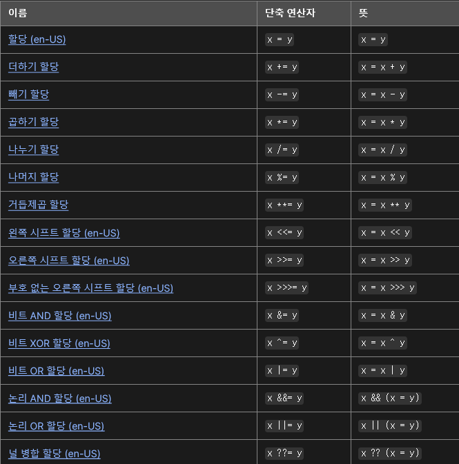
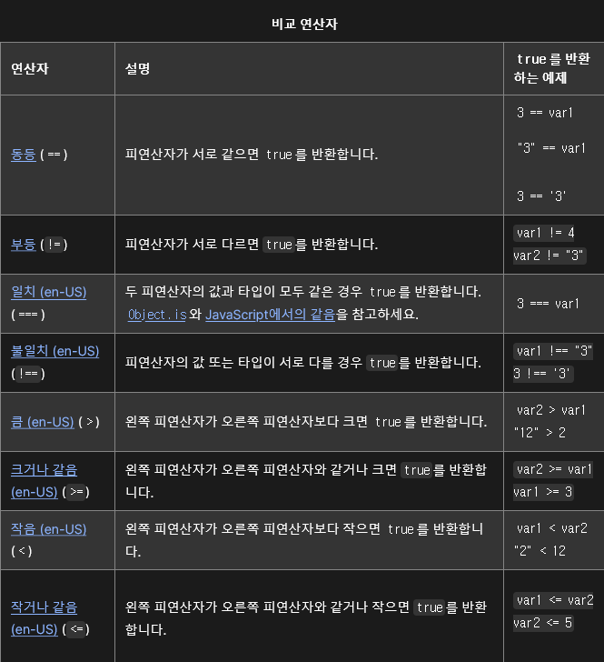
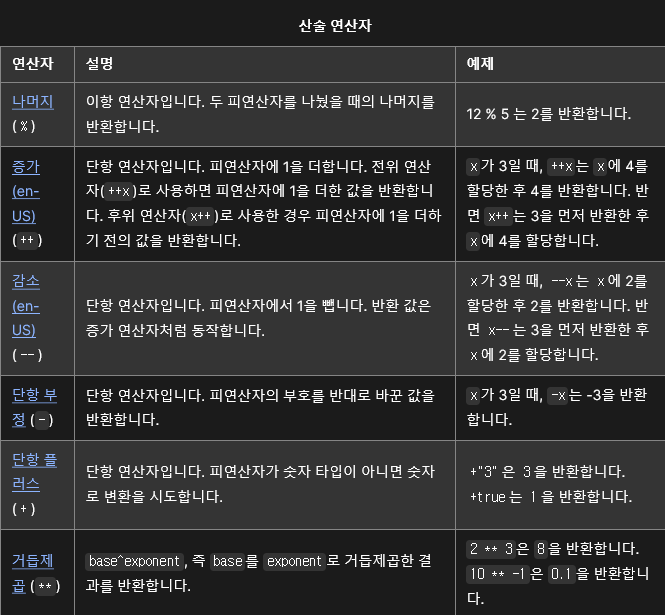
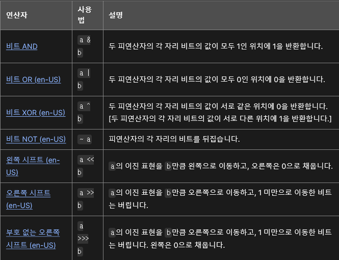
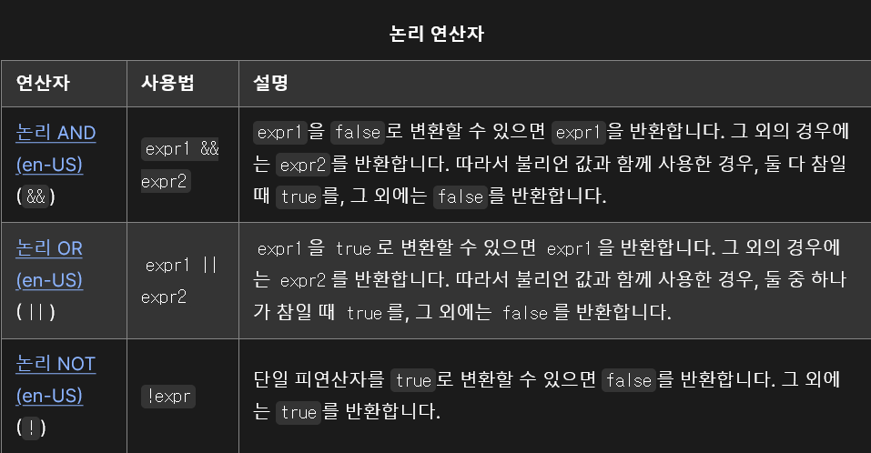
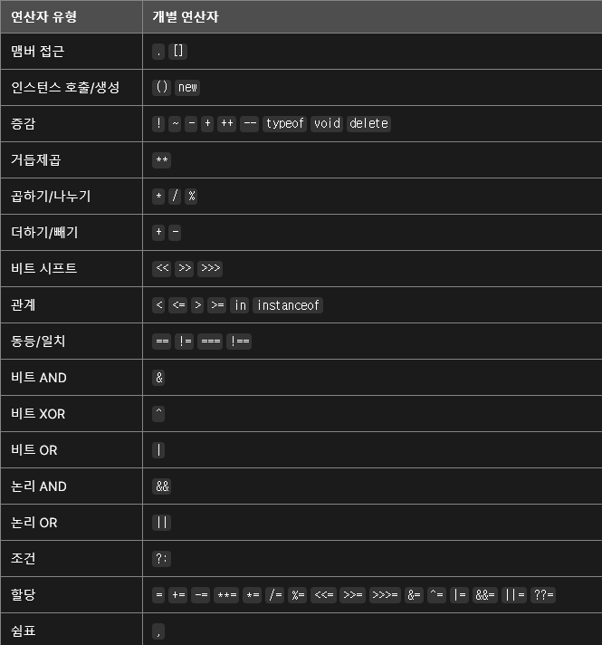

# 자바스크립트
## 자바스크립트란??
자바스크립트(JavaScript)는 웹 페이지에서 복잡한 기능을 구현할 수 있도록 하는 스크립팅 언어 또는 프로그래밍 언어.

### html, css, javascript의 차이점
이 세가지의 차이점으로는
* [HTML](https://developer.mozilla.org/ko/docs/Glossary/HTML)은 웹 콘텐츠의 구조를 짜고 의미를 부여하는 마크업 언어이다. 예를 들어 페이지의 어디가 문단이고, 헤딩이고, 데이터 표와 외부 이미지/비디오인지 정의한다.
* [CSS](https://developer.mozilla.org/ko/docs/Glossary/CSS)는 HTML 콘텐츠에 스타일을 적용할 수 있는 스타일 규칙 언어이다. 배경색을 추가하고, 글꼴을 바꾸고, 콘텐츠를 신문처럼 다열 레이아웃으로 배치가 가능.
* [JavaScript](https://developer.mozilla.org/ko/docs/Glossary/JavaScript)는 동적으로 콘텐츠를 바꾸고, 멀티미디어를 제어하고, 애니메이션을 추가하는 등 거의 모든 것을 만들 수 있는 스크립팅 언어이다.

#### 간단한 예시를 들어보기
```html
<p>Player 1: Chris</p>
```
html의 body에 들어가는 텍스트레이블이다.


여기에 css를 추가해보면
```html
p {
  font-family: 'helvetica neue', helvetica, sans-serif;
  letter-spacing: 1px;
  text-transform: uppercase;
  text-align: center;
  border: 2px solid rgba(0, 0, 200, 0.6);
  background: rgba(0, 0, 200, 0.3);
  color: rgba(0, 0, 200, 0.6);
  box-shadow: 1px 1px 2px rgba(0, 0, 200, 0.4);
  border-radius: 10px;
  padding: 3px 10px;
  display: inline-block;
  cursor: pointer;
}
```
이 예시를 css파일을 만들어 작성하고 적용을 시키거나 html파일에 style태그에 추가해주면 적용이된다.


그리고 다음에 스크립트를 곁들여 주면 동적인 기능이 추가된다.

```html
<script>
const para = document.querySelector('p');

para.addEventListener('click', updateName);

function updateName() {
  const name = prompt('Enter a new name');
  para.textContent = `Player 1: ${name}`;
}
</script>
```


### 자바스크립트의 기능
js의 기능은 다음과 같다.
* 변수에 값을 저장할 수 있다. 바로 위의 예제에서 이름을 입력하면  `name`이라는 변수에 저장하게 된다.
* 프로그래밍에서 "문자열"(string)이라고 부르는, 텍스트 조각을 조작한다. 위 예제에서는 문자열 "플레이어 1: "과 `name` 변수의 값을 합쳐 온전한 텍스트 레이블("Player 1: Chris")을 생성한다.
* 페이지에서 발생하는 어떤 이벤트에 코드가 응답하도록 한다. 예제에서는 [click](https://developer.mozilla.org/ko/docs/Web/API/Element/click_event "/ko/docs/Web/Reference/Events/click") 이벤트를 사용해서 레이블을 클릭하는 순간을 탐지하고, 그 후에 텍스트 레이블을 업데이트하고 있습니다.(레이블을 클릭하면 이벤트가 발생하고 이름을'abc'를 입력하면 Chris에서 abc로 바꾼다.)

## DOM
Document Object Model / 문서 객체 모델

문서 객체 모델(The Document Object Model, 이하 DOM) 은 HTML, XML 문서의 프로그래밍 interface 이다. DOM은 문서의 구조화된 표현(structured representation)을 제공하며 프로그래밍 언어가 DOM 구조에 접근할 수 있는 방법을 제공하여 그들이 문서 구조, 스타일, 내용 등을 변경할 수 있게 돕는다. DOM 은 nodes와 objects로 문서를 표현한다. 이들은 웹 페이지를 스크립트 또는 프로그래밍 언어들에서 사용될 수 있게 연결시켜주는 역할을 담당한다.

웹 페이지는 일종의 문서(document)다. 이 문서는 웹 브라우저를 통해 그 내용이 해석되어 웹 브라우저 화면에 나타나거나 HTML 소스 자체로 나타나기도 한다. 동일한 문서를 사용하여 이처럼 다른 형태로 나타날 수 있다는 점에 주목할 필요가 있다. DOM 은 동일한 문서를 표현하고, 저장하고, 조작하는 방법을 제공한다. DOM 은 웹 페이지의 객체 지향 표현이며, 자바스크립트와 같은 스크립팅 언어를 이용해 DOM 을 수정할 수 있다.

#### DOM과 JS
```Javascript
var paragraphs = document.getElementsByTagName("P");
// paragraphs[0] is the first <p> element
// paragraphs[1] is the second <p> element, etc.
alert(paragraphs[0].nodeName);
```

위의 예제는 JS로 작성되었다. 하지만 문서와 그 요소에 접근하기 위해 DOM이 사용된 경우이다. DOM 은 프로그래밍 언어는 아니지만 DOM 이 없다면 자바스크립트 언어는 웹 페이지 또는 XML 페이지 및 요소들과 관련된 모델이나 개념들에 대한 정보를 갖지 못하게 된다. 문서의 모든 element - 전체 문서, 헤드, 문서 안의 table, table header, table cell 안의 text - 는 문서를 위한 document object model 의 한 부분이다. 때문에, 이러한 요소들을 DOM 과 자바스크립트와 같은 스크립팅 언어를 통해 접근하고 조작할 수 있는 것이다.

#### DOM 객체
 Wndow: `Window` 인터페이스는 DOM 문서를 담은 창을 나타내며, 다양한 함수, 이름공간, 객체, 생성자가 머무는 장소이다.

 `Document`인터페이스는 브라우저가 불러온 웹 페이지를 나타내며, 페이지 콘텐츠(DOM트리)의 진입점 역할을 수행한다. DOM 트리는 <body>와 <table> 및 그외 다른 요소를 포함한다. Document는 페이지의 URL을 얻거나 문서에 새로운 요소를 생성하는 등의 기능을 전역적으로 제공한다. Document 인터페이스는 모든 종류의 문서에 대한 공통의 속성과 메서드를 묘사한다.

 그 외 navigator, location, history, screen이 있다.

## 문법과 자료형
### 기본

JavaScript는 문법의 대부분을 Java와 C, C++로부터 차용하고 있으며, Awk, Perl, Python의 영향도 받았다.
대소문자를 구별하며, 유니코드 문자셋을 사용한다.

JS는 명령을 명령문(statement)이라고 부르며, 세미콜론(;)으로 구분한다.
명령문이 한 줄을 다 차지할 경우에는 세미콜론이 필요하지 않지만 한 줄에 두 개 이상의 명령문이 필요하다면 반드시 세미콜론으로 구분해야 한다.

JavaScript의 스크립트 소스는 왼쪽에서 오른쪽으로 탐색하면서 토큰, 제어 문자, 줄바꿈 문자, 주석이나 공백으로 이루어진 입력 요소의 시퀀스로 변환된다. (스페이스, 탭, 줄바꿈 문자는 공백으로 간주됨.)

### 주석

주석의 구문은 C++ 및 다른 많은 언어와 같다.
```Javascript
// 한 줄 주석

/* 이건 더 긴,
 * 여러 줄 주석입니다.
 */

/* 그러나, /* 중첩된 주석은 쓸 수 없습니다 */ SyntaxError */
```
주석은 공백처럼 행동하며 스크립트 실행 시 버려진다.

### 선언
JS의 선언에는 3가지가 있다.

1. var
변수를 선언, 추가로 동시에 값을 초기화
2. let
블록 스코프 지역 변수를 선언, 추가로 동시에 값을 초기화
3. const
블록 스코프 읽기 전용 상수를 선언.

### 변수
애플리케이션에서 값에 상징적인 이름으로 변수를 사용합니다. 변수명은 식별자(identifiers)라고 불리며 특정 규칙을 따른다.

JavaScript 식별자는 문자, 밑줄 (_) 혹은 달러 기호 ($)로 시작해야 하는 반면 이후는 숫자 (0–9) 일 수도 있다.

JavaScript가 대소문자를 구분하기에, 문자는 "A"부터 "Z" (대문자)와 "a"부터 "z" (소문자)까지 모두 포함.

### 변수 선언

1. var x = 42와 같이 var 키워드로 변수를 선언할 수 있다. 이 구문은 실행 맥락에 따라 지역 및 전역 변수를 선언하는데 모두 사용될 수 있다.

2. let y = 13와 같이 const 혹은 let 키워드로 변수를 선언할 수 있다. 이 구문은 블록 스코프 지역 변수를 선언하는데 사용될 수 있다.

3. 구조 분해 할당 구문을 사용하여 객체 리터럴에서 값을 풀기 위해 변수를 선언할 수 있다. 예를 들면, let { bar } = foo 이 구문은 bar라는 이름의 변수를 생성하고 foo 객체에 있는 동일한 이름의 키에 해당하는 값을 변수에 할당한다.

### 변수 할당

지정된 초기 값 없이 var 혹은 let 문을 사용해서 선언된 변수는 undefined 값을 갖는다.

선언되지 않은 변수에 접근을 시도하는 경우 ReferenceError가 발생한다.

예를 들면

```Javascript
var a;
console.log('a 값은 ' + a); // a 값은 undefined

console.log('b 값은 ' + b); // b 값은 undefined
var b;
// 우선 호이스팅(hoisting)이란, 인터프리터가 변수와 함수의 메모리 공간을 선언 전에 미리 할당하는 것을 의미하는데
// 위의 var로 선언한 변수의 경우 호이스팅 시 undefined로 변수를 초기화한다.


console.log('c 값은 ' + c); // Uncaught ReferenceError: c is not defined

let x;
console.log('x 값은 ' + x); // x 값은 undefined

console.log('y 값은 ' + y); // Uncaught ReferenceError: y is not defined
let y;
//let과 const로 선언한 변수의 경우 호이스팅 시 변수를 초기화하지 않는다. 그래서 ReferenceError가 발생한다.
```

### 변수 스코프

어떤 함수의 바깥에 변수를 선언하면, 현재 문서의 다른 코드에 해당 변수를 사용할 수 있기에 전역 변수라고 한다. 만약 함수 내부에 변수를 선언하면, 오직 그 함수 내에서만 사용할 수 있기에 지역 변수라고 부른다.

#### 그래서 스코프란??

정의는 '식별자 접근 규칙에 따른 유효 범위'이다.
식별자(변수, 함수, 클래스)에 접근할 수 있는 범위가 존재한다.
범위는 중괄호(Block) 또는 함수에 의해 나눠진다.
그 범위는 스코프라 부르며, 각각 Block Scope, Function Scope라고 부른다.

### 변수 호이스팅

또 다른 JavaScript 변수의 특이한 점은 예외를 받지 않고도, 나중에 선언된 변수를 참조할 수 있다는 것이다.

이 개념은 호이스팅(hoisting)이라고 부른다. JavaScript 변수가 어떤 의미에서 함수나 문의 최상단으로 "올려지는" (혹은 "끌어올려지는") 것을 말하는데, 끌어올려진 변수는 undefined 값을 반환한다. 그래서 심지어 이 변수를 사용 혹은 참조한 후에 선언 및 초기화하더라도, 여전히 undefined를 반환한다.

아래 두가지 예는 서로 동일하게 볼 수 있다.

```Javascript
/**
 * Example 1
 */
console.log(x === undefined); // true
var x = 3;

/**
 * Example 1
 */
var x;
console.log(x === undefined); // true
x = 3;

```

```Javascript

/**
 * Example 2
 */
// undefined 값을 반환함.
var myvar = "my value";

(function() {
  console.log(myvar); // undefined
  var myvar = "local value";
})();

/**
 * Example 2
 */
var myvar = 'my value';

(function() {
  var myvar;
  console.log(myvar); // undefined
  myvar = 'local value';
})();

```

### 함수 호이스팅

함수에서는 함수 선언으로는 호이스팅되지만 함수 표현식으로는 호이스팅 되지 않는다.

```Javascript

/* 함수 선언 */

foo(); // "bar"

function foo() {
  console.log('bar');
}

/* 함수 표현식 */

baz(); // TypeError: baz is not a function

var baz = function() {
  console.log('bar2');
};

```

### 전역 변수

전역 변수는 전역 객체의 속성(property)이다.

웹 페이지에서 전역 객체는 window 이므로, windows.variable 구문을 통해 전역 변수를 설정하고 접근할 수 있다.

그 결과, window 혹은 frame의 이름을 지정하여 한 window 혹은 frame에서 다른 window 혹은 frame에 선언된 전역 변수에 접근할 수 있다. 예를 들어, phoneNumber 라는 변수가 문서에 선언된 경우, iframe에서 parent.phoneNumber로 이 변수를 참조할 수 있다.

### 상수

const 키워드로 읽기 전용 상수를 만들 수 있다.

상수 식별자의 구문은 변수 식별자와 같으며, 문자, 밑줄이나 달러 기호 ($) 로 시작해야 하고 문자, 숫자나 밑줄을 포함할 수 있다.

상수는 스크립트가 실행 중인 동안 대입을 통해 값을 바꾸거나 재선언될 수 없다. 값으로 초기화해야 합니다.

상수에 대한 스코프 규칙은 let 블록 스코프 변수와 동일하다. 만약 const 키워드가 생략된 경우에는, 식별자는 변수를 나타내는 것으로 간주됨.

상수는 같은 스코프에 있는 함수나 변수와 동일한 이름으로 선언할 수 없다.

### 데이터 구조 및 형
#### 데이터 형
최신 ECMAScript 표준은 8가지 데이터 형을 정의한다.

  * 7가지 원시 데이터 형
    * Boolean. true와 false
    * null. null 값을 나타내는 특별한 키워드. (JavaScript는 대소문자를 구분하므로, null은 Null, NULL 혹은 다른 변형과도 다릅니다.)
    * undefined. 값이 정의되어 있지 않은 최상위 속성.
    * Number (en-US). 정수 또는 실수형 숫자. 예: 42 혹은 3.14159.
    * BigInt (en-US). 임의 정밀도의 정수. 예: 9007199254740992n.
    * String. 문자열. 예:"안녕"
    * Symbol. (ECMAScript 2015에 도입) 인스턴스가 고유하고 불변인 데이터 형.
    * 그리고 Object

#### 자료형 변환

JavaScript는 동적 형지정(정형) 언어이며, 이는 변수를 선언할 때 데이터 형을 지정할 필요가 없음을 의미한다. 또한 데이터 형이 스크립트 실행 도중 필요에 의해 자동으로 변환됨을 뜻한다.

예를들어, 처음 변수를 정의하고
```Javascript
var answer = 42;
```
나중에 동일한 변수에 문자열 값을 할당할 수도 있다.
```Javascript
var answer = 'ABCDEFG';
```
JavaScript는 동적 형지정 언어이므로, 이 할당은 오류 메시지가 발생하지 않습니다.

## 제어 흐름과 오류 처리

### 블록문

가장 기본적인 명령문은, 명령문들을 그룹으로 묶을 수 있는 블록문이다. 블록문의 블록은 한 쌍의 중괄호로 감싸는 것으로 나타낸다.
블록문은 주로 제어 명령문과 많이 사용한다.(if, for, while)

### 조건문

조건문은 지정한 조건이 참인 경우에 실행하는 명령 집합이다. JavaScript는 if/else와 switch 두 종류의 조건문을 지원한다.

#### if/else문

명령문의 논리 조건이 참인 경우에 if문을 사용한다. 또, 선택적으로 else절을 추가해서 조건이 거짓인 경우에 실행할 명령문을 지정할 수 있다.

```Javascript
if (condition) {
  statement_1;
} else {
  statement_2;
}
```

위 예제에서 condition이 true로 평가되면 statement_1을 실행한다. 그렇지 않으면 statement_2를 실행한다. statement_1과 statement_2에는 다른 if 문을 포함해 아무 명령문이나 사용이 가능하다.

그리고 else if를 통해 다수의 조건을 순차적으로 검사할 수도 있다.

#### 거짓 값(false)

다음 값들은 거짓으로 평가된다.

  * false
  * undefined
  * null
  * 0
  * NaN
  * 빈 문자열 ("")

객체를 포함해 다른 모든 값은 조건문에 전달했을 때 true로 평가된다.

#### switch
switch 문은 프로그램이 표현식을 평가한 후, 그 값과 case 레이블의 값을 비교해 일치하는 case의 명령문을 실행한다.

#### break
각각의 case에는 선택적으로 break 문을 추가할 수 있다. break는 case의 명령문을 실행한 후에 프로그램이 switch의 밖으로 나가도록 한다. break를 생략하면 프로그램은 switch 문을 탈출하지 않고, 다음 case의 명령문을 실행한다.

### 예외 처리 명령문
throw문을 사용하여 예외를 던질 수 있고, try/catch 문으로 처리할 수 있다.

#### throw
예외를 던질 땐 throw를 사용하며, 특정 타입의 표현식이 아니라 무엇이든 던질 수 있다.

#### try/catch
try/catch 문은 실행을 시도할 블록을 표시하고, 그 안에서 예외가 발생할 경우 처리를 맡을 하나 이상의 반응 명령문을 지정한다. 예외가 발생하면, try/catch 문이 잡아낸다.

try/catch 문은 하나 이상의 명령문을 포함하는 try 블록, 그리고 try에서 예외가 발생할 경우 그 예외를 처리할 명령문을 담은 하나의 catch 블록으로 구성한다.

#### catch 블록

try 블록에서 발생할 수 있는 모든 예외는 catch 블록에서 처리할 수 있다.
catch 블록은 throw 명령문이 던진 예외의 값을 담을 식별자를 지정한다. 이 식별자를 통해, 발생한 예외의 정보를 알아낼 수 있다.

JavaScript는 catch 블록에 진입해야 예외의 식별자를 생성하고, catch 블록의 밖으로 나가면 식별자를 더 이상 유지하지 않는다. 즉, catch 블록의 실행이 끝나면 예외 식별자에 접근할 수 없다.

#### finally 블록

finally 블록은 try와 catch 블록 실행이 끝난 후 이어서, 그리고 try...catch...finally 문 이후의 명령문들보다는 먼저 실행할 명령문을 담는다.

finally 블록은 try 블록 안에서 예외가 발생했는지 여부에 관계 없이, catch 블록이 따로 존재하지 않더라도 항상 실행된다.

## 루프와 반복

### for
for 반복문은 어떤 특정한 조건이 거짓으로 판별될 때까지 반복한다. 자바스크립트의 반복문은 C의 반복문과 유사하다.
예를 들면
for ([초기문]; [조건문]; [증감문])
      문장

for문이 실행될 때:

    1. 초기화 구문인 초기문이 존재한다면 초기문이 실행된다. 이 표현은 보통 1이나 반복문 카운터로 초기 설정이 된다. 그러나 복잡한 구문으로 표현 될 때도 있으며 또한 변수로 선언 되기도 한다.
    2. 조건문은 조건을 검사한다. 만약 조건문이 참이라면, 그 반복문은 실행되고 만약 조건문이 거짓이라면, 그 for문은 종결된다. 만약 그 조건문이 생략된다면, 그 조건문은 참으로 추정됨.
    3. 문장이 실행된다. 많은 문장을 실행할 경우엔, { } 를 써서 문장들을 묶어 준다.
    4. 갱신 구문인 증감문이 존재한다면 실행되고 2번째 단계로 돌아간다.

### do/while
do...while 문은 특정한 조건이 거짓으로 판별될 때까지 반복한다.
예를 들면
    do
      문장
    while (조건문);

조건문을 확인하기 전에 문장은 한번 실행된다. 많은 문장을 실행하기 위해선 { }를 써서 문장들을 묶어주고 만약 조건이 참이라면, 그 문장은 다시 실행된다. 매 실행 마지막마다 조건문이 확인된다. 만약 조건문이 거짓일 경우, 실행을 멈추고 do...while 문 바로 아래에 있는 문장으로 넘어가게 한다.

### while
while 문은 어떤 조건문이 참이기만 하면 문장을 계속해서 수행한다.
예를 들면
    while (조건문)
      문장

만약 조건문이 거짓이 된다면, 그 반복문 안의 문장은 실행을 멈추고 반복문 바로 다음의 문장으로 넘어간다.

### 레이블(label)
레이블은 프로그램에서 다른 곳으로 참조할 수 있도록 식별자로 문을 제공한다.
루프를 식별하기 위해 레이블을 사용하고, 프로그램이 루프를 방해하거나 실행을 계속할지 여부를 나타내기 위해 break나 continue 문을 사용할 수 있다.

### break

break문은 반복문, switch문, 레이블 문과 결합한 문장을 빠져나올 때 사용한다.

  * 레이블 없이 break문을 쓸 때: 가장 가까운 while, do-while, for, 또는 switch문을 종료하고 다음 명령어로 넘어간다.
  * 레이블 문을 쓸 때: 특정 레이블 문에서 끝남.

break문의 문법:

    break;
    break 레이블;

break문의 첫번째 형식은 가장 안쪽의 반복문이나 switch문을 빠져나온다. 두번째 형식은 특정한 레이블 문을 빠져나온다.

### continue

continue 문은 while, do-while, for, 레이블 문을 다시 시작하기 위해 사용될 수 있다.

    레이블없이 continue를 사용하는 경우, 그것은 가장 안쪽의 while, do-while, for 문을 둘러싼 현재 반복을 종료하고, 다음 반복으로 루프의 실행을 계속한다. break문과 달리, continue 문은 전체 루프의 실행을 종료하지 않는다. while 루프에서 다시 조건으로 이동하며 for 루프에서 업데이트 표현식으로 이동한다.
    레이블과 함께 continue를 사용하는 경우, continue는 그 레이블로 식별되는 루프 문에 적용된다.

continue 문의 구문:

    continue;
    continue 레이블;

### for...in

for...in 문은 객체의 열거 속성을 통해 지정된 변수를 반복한다. 각각의 고유한 속성에 대해, JavaScript는 지정된 문을 실행한다.
for...in 문:

for (variable in object) {
  statements
}

### for...of

for...of 문은 각각의 고유한 특성의 값을 실행할 명령과 함께 사용자 지정 반복 후크를 호출하여, 반복 가능한 객체(배열, Map, Set, 인수 객체 등을 포함)를 통해 반복하는 루프를 만든다.

    for (variable of object) {
      statement
    }

## 함수
함수는 JavaScript에서 기본적인 구성 블록 중의 하나. 함수는 작업을 수행하거나 값을 계산하는 문장 집합 같은 자바스크립트 절차이다. 함수를 사용하려면 함수를 호출하고자 하는 범위 내에서 함수를 정의해야만 한다.

### 함수 정의
#### 함수 선언
함수 정의(또는 함수 선언)는 다음과 같은 함수 키워드로 구성되어 있다:

  * 함수의 이름
  * 괄호 안에서 쉼표로 분리된 함수의 매개변수 목록
  * 중괄호 { } 안에서 함수를 정의하는 자바스크립트 표현

#### 함수 표현식
위에서 함수 선언은 구문적인 문(statement)이지만, 함수 표현식(function expression)에 의해서 함수가 만들어 질 수도 있다. 이 같은 함수를 익명이라고 하며. 모든 함수가 이름을 가질 필요는 없다는 것을 뜻한다.

### 함수 호출
함수를 정의하는 것은 함수를 실행하는 것이 아니다. 함수를 정의하는 것은 간단히 함수의 이름을 지어주고, 함수가 호출될 때 무엇을 할지 지정 해주는 것이다. 함수를 호출하는 것은 나타나있는 매개변수를 가지고 지정된 행위를 수행하는 것.

### 함수의 범위
함수 내에서 정의된 변수는 변수가 함수의 범위에서만 정의되어 있기 때문에, 함수 외부의 어느 곳에서든 액세스할 수 없다. 그러나, 함수가 정의된 범위 내에서 정의된 모든 변수나 함수는 액세스가 가능. 즉, 전역함수는 모든 전역 변수를 액세스할 수 있다. 다른 함수 내에서 정의 된 함수는 부모 함수와 부모 함수가 액세스 할 수 있는 다른 변수에 정의된 모든 변수를 액세스할 수 있다.

### 범위와 함수 스택
#### 재귀
자신을 호출하는 함수를 재귀 함수라고 한다. 어떤 면에서, 재귀는 루프와 유사. 둘 다 동일한 코드를 여러 번 실행하고, 조건을 요구한다.
재귀적 알고리즘은 비 재귀적인 알고리즘으로 변환 할 수 있다. 그러나 변환된 알고리즘이 훨씬 더 복잡하며 그렇게 함으로써 스택의 사용을 요구한다.

#### 중첩된 함수와 클로저
중첩 된 (내부) 함수는 그것을 포함하는 (외부) 함수와 별개이다. 그것은 또한 클로저를 형성한다. 클로저는 그 변수(“폐쇄”라는 표현)를 결합하는 환경을 자유롭게 변수와 함께 가질 수 있는 표현(전형적인 함수).
중첩 함수는 클로저이므로, 중첩된 함수는 그것을 포함하는 함수의 인수와 변수를 “상속”할 수 있는 것을 의미한다. 즉, 내부 함수는 외부 함수의 범위를 포함.
요약하면:

  * 내부 함수는 외부 함수의 명령문에서만 액세스할 수 있다.

  * 내부 함수는 클로저를 형성: 외부 함수는 내부 함수의 인수와 변수를 사용할 수 없는 반면에, 내부 함수는 외부 함수의 인수와 변수를 사용할 수 있다.

### 이름 충돌
클로저의 범위에서 두 개의 인수 또는 변수의 이름이 같은 경우, 이름 충돌이 있다. 더 안쪽 범위가 우선순위를 갖는다. 그래서 가장 바깥 범위는 우선순위가 가장 낮은 반면에, 가장 안쪽 범위는 가장 높은 우선순위를 갖는다. 이것이 범위 체인(scope chaini)이라고 한다. 체인에서 첫번째는 가장 안쪽 범위이고, 마지막은 가장 바깥 쪽의 범위이다.

### 클로저
클로저는 자바스크립트의 강력한 기능 중 하나이다. 자바스크립트는 함수의 중첩(함수 안에 함수를 정의하는것)을 허용하고, 내부함수가 외부 함수 안에서 정의된 모든 변수와 함수들을 완전하게 접근 할 수 있도록 승인해준다.(그리고 외부함수가 접근할수 있는 모든 다른 변수와 함수들까지) 그러나 외부 함수는 내부 함수 안에서 정의된 변수와 함수들에 접근 할 수 없다. 이는 내부 함수의 변수에 대한 일종의 캡슐화를 제공하며 또한, 내부함수는 외부함수의 범위에 접근할 수 있기 때문에, 내부 함수가 외부 함수의 수명을 초과하여 생존하는 경우, 외부함수에서 선언된 변수나 함수는 외부함수의 실행 기간보다 오래간다. 클로저는 내부 함수가 어떻게든 외부 함수 범위 밖의 모든 범위에서 사용 가능해지면 생성된다.

### 인수(arguments) 객체 사용하기
인수(arguments) 객체를 이용하면, 보통 함수에 정의된 개수보다 많은 인수를 넘겨주면서 함수를 호출할 수 있다. 이것은 얼마나 많은 인수가 함수로 넘겨질지 모르는 상황에서 유용하다. arguments.length를 함수에 실제로 넘겨받은 인수의 수를 알아낼 때 사용할 수 있고 , 각각의 인수에 인수(arguments) 객체를 이용하여 접근 할 수 있다.

### 함수의 매개변수
#### 디폴트
자바스크립트에서, 함수의 매개변수는 undefined 가 기본으로 설정된다. 하지만, 어떤 상황에서는 다른 값을 기본값으로 가진 것이 유용할 때가 있는데, 이때가 디폴트 매개변수가 도움을 줄 수 있는 상황이다.
#### 나머지 매개변수
나머지 매개변수 구문을 사용하면 배열로 불확실한 개수의 인수를 나타낼 수 있다.

### 화살표 함수
화살표 함수 표현 (뚱뚱한 화살표(fat arrow) 함수라고 알려진)은 함수 표현과 비교하였을때 짧은 문법을 가지고 있고 사전적으로 this 값을 묶는다. 화살표 함수는 언제나 익명.

## 표현식과 연산자
### 연산자
JS의 연산자:
  * 할당 연산자
  * 비교 연산자
  * 산술 연산자
  * 비트 연산자
  * 논리 연산자
  * 문자열 연산자
  * 조건 (삼항) 연산자
  * 쉼표 연산자
  * 단항 연산자
  * 관계 연산자

JavaScript는 이항 연산자와 단항 연산자를 모두 포함하며, 유일한 삼항 연산자로 조건 연산자도 가지고 있다. 이항 연산자는 연산자의 앞과 뒤에 하나씩 총 두 개의 피연산자가 필요.
단항 연산자는 연산자의 앞이나 뒤에 하나의 피연산자가 필요하다.

### 할당 연산자
할당 연산자는 오른쪽 피연산자의 값을 왼쪽 피연산자에 할당한다. 기본적인 할당 연산자는 오른쪽의 피연산자 값을 왼쪽 피연산자 값에 할당하는 등호(=)로, x = y 는 y의 값을 x에 할당한다.


#### 속성 할당
어떤 표현식이 객체로 평가된다면, 할당 표현식의 좌항은 객체로 평가되는 표현식의 속성에 할당할 수 있으며, 어떤 표현식이 객체로 평가되지 않으면, 그 표현식의 속성에 대한 할당 표현식은 실제로는 할당하지 않는다.
수정 불가능한 속성이나, 속성이 없는 표현식(null이나 undefined)으로 할당을 시도하면 오류가 발생한다.

#### 구조 분해
구조 분해 할당 구문은 JavaScript 표현식 중 하나로, 객체나 배열을 생성할 때와 비슷한 구문으로 사용해서 어떤 객체나 배열에서 데이터를 추출할 수 있다.

#### 반환 값의 체이닝
일반적으로, 할당 표현식은 변수 선언(const, let, var)과 함께 쓰이거나 독립적인 명령문으로 사용된다.
할당 표현식을 체이닝하거나 중첩함으로써 할당의 결과를 다시 다른 변수에 할당할 수 있습니다. 아니면 콘솔에 기록할 수도 있고, 배열 리터럴이나 함수 호출에 사용할 수도 있다.
할당 표현식을 괄호나 배열 리터럴같은 그룹 연산자 없이 체이닝하면, 할당 표현식은 오른쪽에서 왼쪽으로 묶이지만(우측 결합), 왼쪽에서 오른쪽으로 평가된다.

### 비교 연산자
비교 연산자는 피연산자를 서로 비교하고, 비교 결과가 참인지에 따라 논리 값을 반환한다. 피연산자로는 숫자, 문자열, 논리형, 객체 값을 사용할 수 있습다. 문자열은 Unicode 값을 사용한 표준 사전식 순서에 따라 비교한다. 만약 두 피연산자가 서로 다른 타입이면, JavaScript는 피연산자들을 서로 비교하기에 적합한 타입으로 변환한다. 이 동작은 대개 두 값을 모두 숫자로 변환한 후 비교한 결과를 낳는다. 비교 연산에서 발생하는 타입 변환의 유일한 예외는 ===과 !== 연산자를 사용해 엄격 일치와 불일치 비교를 수행하는 경우인데, 두 연산자는 비교 전에 피연산자를 변환하지 않는다.



### 산술 연산자
산술 연산자는 두 개의 숫자 값(리터럴 또는 변수)을 피연산자로 받아서 하나의 숫자 값을 반환한다. 표준 산술 연산자는 더하기(+), 빼기(-), 곱하기(*), 나누기(/)이다. 이 연산자들은 대부분의 다른 프로그래밍 언어에서 부동소수점 값을 연산할 때와 동일하게 동작한다.



### 비트 연산자
비트 연산자는 피연산자를 10진수, 16진수, 8진수 숫자로 취급하지 않고, 대신 32개 비트의 집합으로 취급한다. 비트 연산자는 이러한 이진법 표현에 대해 연산을 수행하지만, 반환할 땐 JavaScript 표준 숫자로 반환한다. 



### 논리 연산자
논리 연산자는 보통 불리언(논리) 값과 함께 사용해서 불리언 값을 반환한다. 그러나 &&와 || 연산자는 사실 두 피연산자 중 하나를 반환하는 것으로, 만약 둘 중 하나가 불리언 값이 아니라면 논리 연산자의 반환 값도 불리언 값이 아닐 수 있다.



### 문자열 연산자
문자열에 사용할 수 있는 비교 연산자들 외에도, 문자열 연결(+) 연산자는 두 문자열의 값을 서로 연결한 새로운 문자열을 반환한다.

### 조건 연산자
조건 연산자는 JavaScript에서 세 개의 피연산자를 받는 유일한 연산자입니다. 조건 연산자는 주어진 조건에 따라 두 값 중 하나를 반환한다.

### 쉼표 연산자
쉼표 연산자(,)는 두 피연산자를 모두 평가한 후 오른쪽 피연산자의 값을 반환한다. 쉼표 연산자는 주로 for 반복문 안에서 사용하여 한 번의 반복으로 여러 변수를 변경할 때 사용하며, 꼭 필요하지 않다면, 그 외의 상황에 사용하는 것은 좋지 않은 코드 스타일로 여겨진다.

### 단항 연산자
단항 연산은 오직 하나의 피연산자만 사용하는 연산이다.

#### delete
delete연산자는 객체의 속성을 삭제한다.
delete 연산자가 속성을 성공적으로 삭제한 이후, 해당 속성을 접근하려고 하면 undefined가 반환된다. delete는 속성을 제거할 수 있는 경우에는 true를 반환하고, 제거할 수 없을 땐 false를 반환한다.

#### typeof
typeof 연산자는 평가 전의 피연산자 타입을 나타내는 문자열을 반환한다.

#### void
void 연산자는 표현식을 평가할 때 값을 반환하지 않도록 지정한다.

### 관계 연산자
관계 연산자는 피연산자를 서로 비교하고, 비교 결과가 참인지에 따라 불리언 값을 반환한다.

#### in
in 연산자는 지정한 속성이 지정한 객체에 존재할 경우 true를 반환한다.

#### instanceof
instanceof 연산자는 지정한 객체가 지정한 객체 타입에 속하면 true를 반환한다.

### 연산자 우선순위
연산자의 우선순위는 표현식을 평가할 때 연산자를 적용하는 순서를 결정한다. 괄호를 사용하면 우선순위를 바꿀 수 있다.



### 표현식
표현식이란 어떤 값으로 이행하는 임의의 유효한 코드 단위를 말한다.

모든 표현식은 구문이 유효하다면 어떤 값으로 이행하지만, 개념적으로는 두 가지 범주로 나뉘며, 하나는 부수 효과가 있는 (예시: 변수에 값을 할당) 표현식이고, 다른 하나는 평가하면 어떤 값으로 이행하는 표현식이다.

JavaScript의 표현식은 다음과 같은 범주로 구분할 수 있다.

  * 산수: 숫자, 예컨대 3.14159로 평가됩니다. 보통 산술 연산자를 사용합니다.
  * 문자열: 문자열, 예컨대 "프레디", "234" 등으로 평가됩니다. 보통 문자열 연산자를 사용합니다.
  * 논리: 참이나 거짓으로 평가됩니다. 대개 논리 연산자를 포함합니다.
  * 일차 표현식: JavaScript의 키워드와 일반 표현식입니다.
  * 좌변 표현식: 좌변 값은 할당의 목적지입니다.

### 일차 표현식
#### this
일반적으로 this는 메서드의 호출 객체를 참조한다.

#### 그룹 연산자
그룹연산자 ()는 표현식 평가의 우선순위를 조절한다. 예를 들어, 곱하기와 나누기보다 더하기와 빼기 연산을 먼저 수행할 수 있다. 

### 좌변 표현식
좌변 값은 할당의 목적지이다.

#### new
new 연산자를 사용하면 사용자 정의 객체 타입이나 내장 객체 타입의 인스턴스를 생성할 수 있다.

#### super
super 키워드는 객체의 부모가 가진 함수를 호출할 때 사용한다. 예를 하나 들면, 클래스에서 부모의 생성자를 호출해야 할 때 유용하게 쓸 수 있다. 