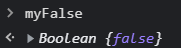
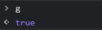
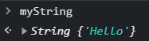
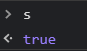

## Const
const는 블록범위의 상수를 선언한다. 상수의 값은 재할당할 수 없으며, 다시 선언할 수도 없다.

```javascript
const num = 42;
try {
  num = 99;
} catch (err) {
  console.log(err);
  // 오류 : TypeError: Assignment to constant variable.
}

console.log(num)
excepted output : 42
```

## let
let 명령문은 블록 스코프의 범위를 가지는 지역 변수를 선언하며, 선언과 동시에 임의의 값으로 초기화할 수 있다.

```javascript
let x = 1;
if (x === 1) {
  let x = 2;
  console.log(x);
  // excepted output : 2
}
console.log(x);
// excepted output : 1
```


## var
var문은 변수를 선언하고, 선택적으로 초기화할 수 있다.

```javascript
var a = 1;
if (a === 1) {
  var a = 2;
  console.log(a);
  // excepted output : 2
}
console.log(a);
// excepted output : 2
```

## Boolean
참조한 링크 : https://developer.mozilla.org/ko/docs/Web/JavaScript/Reference/Global_Objects/Boolean

첫 번째 매개변수로서 전달한 값은 필요한 경우 불리언 값으로 변환됩니다.
값이 없거나 0, -0, null, false, NaN, undefined, 빈 문자열 ("")이라면 객체의 초기값은 false가 됩니다.
문자열 "false"를 포함한 그 외 모든 다른 값은 초기값을 true로 설정합니다.

값이 undefined, null이 아닌 모든 객체는 조건문에서 true로 계산됩니다.
이는 값이 false인 Boolean 객체도 포함합니다. 즉 아래 if 문의 조건은 참입니다.

```javascript
var x_ = new Boolean(false);
if (x_) {
  // 이 코드는 실행됨
}
```


그러나 원시 Boolean 값에는 적용되지 않습니다. 따라서 아래 if 문의 조건은 거짓입니다.

```javascript
var x__ = false;
if (x__) {
  // 이 코드는 실행되지 않음
}
```


```javascript
var x1 = Boolean(expression);     // 추천
var x2 = new Boolean(expression); // 사용하지 말것
```

값이 false인 Boolean 객체를 포함한 어떠한 객체를 Boolean 객체의 초기값으로 넘겨주더라도 새로운 Boolean 객체는 true를 가집니다.

```javascript
var myFalse = new Boolean(false);   // 초기값 거짓 #1
var g = Boolean(myFalse);           // 초기값 참 #2
var myString = new String('Hello'); // 문자열 객체 #3
var s = Boolean(myString);          // 초기값 참 #4
```

#1



#2



#3



#4



## Array(배열)

참조한 링크 : https://developer.mozilla.org/ko/docs/Web/JavaScript/Reference/Global_Objects/Array

배열은 리스트와 비슷한 객체로서 순회와 변형 작업을 수행하는 메서드를 갖습니다.
JavaScript 배열은 길이도, 각 요소의 자료형도 고정되어 있지 않습니다.
배열의 길이가 언제든지 늘어나거나 줄어들 수 있고 데이터를 연속적이지 않은 곳에 저장할 수 있으므로, JavaScript 배열은 밀집성을 보장하지 않습니다.
보통 이런 성질들은 편리하지만, 사용하려는 목적에 맞지 않으면 형식화 배열(typed array)을 사용하는 것을 고려해보세요.

### 자주 사용하는 연산

#### 배열 생성

```javascript
let fruits = ['사과', '바나나']
console.log(fruits.length)
// 2
```

#### 인덱스로 배열의 항목에 접근하기

```javascript
let first = fruits[0]
// 사과
let last = fruits[fruits.length - 1]
// 바나나
```

#### 배열의 항목들을 순환하며 처리하기

```javascript
fruits.forEach(function (item, index, array) {
  console.log(item, index)
})
// 사과 0
// 바나나 1
```

#### 배열 끝에 항목 추가하기

```javascript
let newLength = fruits.push('오렌지')
// ["사과", "바나나", "오렌지"]
```

#### 배열 끝에서부터 항목 제거하기

```javascript
let last = fruits.pop() // 끝에있던 '오렌지'를 제거
// ["사과", "바나나"]

```

#### 배열 앞에서부터 항목 제거하기

```javascript
let first = fruits.shift() // 제일 앞의 '사과'를 제거
// ["바나나"]
```

#### 배열 앞에 항목 추가하기

```javascript
let newLength = fruits.unshift('딸기') // 앞에 추가
// ["딸기", "바나나"]
```

#### 배열 안 항목의 인덱스 찾기

```javascript
fruits.push('망고')
// ["딸기", "바나나", "망고"]

let pos = fruits.indexOf("바나나")
// 1
```

#### 인덱스 위치에 있는 항목 제거하기

```javascript
let removedItem = fruits.splice(pos, 1) // 항목을 제거하는 방법

// ["딸기", "망고"]
```

#### 인덱스 위치에서부터 여러개의 항목 제거하기

```javascript
let vegetables = ['양배추', '순무', '무', '당근']
console.log(vegetables)
// ["양배추", "순무", "무", "당근"]

let pos = 1
let n = 2

let removedItems = vegetables.splice(pos, n)
// 배열에서 항목을 제거하는 방법
// pos 인덱스부터 n개의 항목을 제거함

console.log(vegetables)
// ["양배추", "당근"] (원 배열 vegetables의 값이 변함)

console.log(removedItems)
// ["순무", "무"]
```

#### 배열 복사하기

```javascript
let shallowCopySpread = [...fruits]
// ["딸기", "망고"]
```

### 배열 요소에 접근하기

JavaScript 배열의 인덱스는 0부터 시작합니다. 즉, 배열 첫 번째 요소의 인덱스는 0이고, 마지막 요소의 인덱스는 배열의 length 속성에서 1을 뺀 것과 같습니다.

잘못된 인덱스를 사용하면 undefined를 반환합니다.

```javascript
let arr = ['첫 번째 요소입니다', '두 번째 요소입니다', '마지막 요소입니다']
console.log(arr[0])              // '첫 번째 요소입니다'를 기록
console.log(arr[1])              // '두 번째 요소입니다'를 기록
console.log(arr[arr.length - 1]) // '마지막 요소입니다'를 기록
```

toString이 속성인 것과 마찬가지로 (정확히 하자면, toString()은 메서드입니다) 배열의 요소도 속성입니다. 하지만 배열 요소에 아래 코드처럼 접근하려고 하면, 속성 이름이 유효하지 않기 때문에 구문 오류가 발생합니다.

```javascript
console.log(arr.0) // 구문 오류
```

이 현상은 JavaScript 배열과 그 속성에 어떤 특별한 점이 있어서 그런 것이 아닙니다. 모든 JavaScript 속성은 이름이 숫자로 시작할 경우 마침표 표기법으로 접근할 수 없고, 대괄호 표기법을 사용해야 합니다.

예를 들면, 어떤 객체에 '3d'라는 이름의 속성이 있다면, 이 속성에 접근할 땐 대괄호 표기법을 사용해야만 합니다.

```javascript
let years = [1950, 1960, 1970, 1980, 1990, 2000, 2010]
console.log(years.0)   // 구문 오류
console.log(years[0])  // 정상 작동
```

```javascript
renderer.3d.setTexture(model, 'character.png')     // 구문 오류
renderer['3d'].setTexture(model, 'character.png')  // 정상 작동
```

3d 예시에서 '3d'를 따옴표로 감싸야 함에 유의하세요. JavaScript 배열 인덱스도 years[2] 대신에 years['2']를 사용하듯 따옴표로 둘러쌀 수 있습니다. 그러나 굳이 그럴 필요는 없습니다.

years[2]의 2는 JavaScript 엔진이 암시적인 toString 변환을 사용해 문자열로 변환합니다. 그 결과로서 '2'와 '02'는 years 객체에서 서로 다른 칸을 가리키며, 다음 코드는 true가 될 수 있습니다.

```javascript
console.log(years['2'] != years['02']);
```