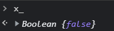
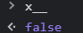

## Const
const는 블록범위의 상수를 선언한다. 상수의 값은 재할당할 수 없으며, 다시 선언할 수도 없다.
const num = 42;
try {
  num = 99;
} catch (err) {
  console.log(err);
  // 오류 : TypeError: Assignment to constant variable.
}

console.log(num)
excepted output : 42

## let
let 명령문은 블록 스코프의 범위를 가지는 지역 변수를 선언하며, 선언과 동시에 임의의 값으로 초기화할 수 있다.

let x = 1;
if (x === 1) {
  let x = 2;
  console.log(x);
  // excepted output : 2
}
console.log(x);
// excepted output : 1

## var
var문은 변수를 선언하고, 선택적으로 초기화할 수 있다.

var a = 1;
if (a === 1) {
  var a = 2;
  console.log(a);
  // excepted output : 2
}
console.log(a);
// excepted output : 2

 Boolean
참조한 링크 : https://developer.mozilla.org/ko/docs/Web/JavaScript/Reference/Global_Objects/Boolean

첫 번째 매개변수로서 전달한 값은 필요한 경우 불리언 값으로 변환됩니다.
값이 없거나 0, -0, null, false, NaN, undefined, 빈 문자열 ("")이라면 객체의 초기값은 false가 됩니다.
문자열 "false"를 포함한 그 외 모든 다른 값은 초기값을 true로 설정합니다.

값이 undefined, null이 아닌 모든 객체는 조건문에서 true로 계산됩니다.
이는 값이 false인 Boolean 객체도 포함합니다. 즉 아래 if 문의 조건은 참입니다.

var x_ = new Boolean(false);
if (x_) {
  // 이 코드는 실행됨
}

그러나 원시 Boolean 값에는 적용되지 않습니다. 따라서 아래 if 문의 조건은 거짓입니다.

var x__ = false;
if (x__) {
  // 이 코드는 실행되지 않음
}

